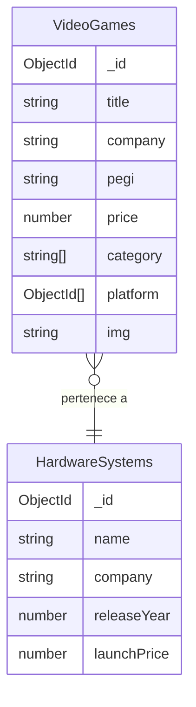

# VideoGames API

Esta API permite gestionar un catálogo de videojuegos y consolas, almacenando datos en MongoDB. Incluye operaciones CRUD completas y relaciones entre colecciones.

API REST construida con **Node.js**, **Express** y **MongoDB (Mongoose)** para la gestión de videojuegos y plataformas de hardware.

Permite crear, leer, actualizar y eliminar videojuegos.

---

## Instalación y uso

1. Clona el repositorio:

   ```bash
   git clone <repo-url>
   cd <repo-folder>
   ```

2. Instala dependencias:

   ```bash
   npm install
   ```

3. Configura las variables de entorno en un archivo `.env`:

   ```env
   DB2_URL=mongodb+srv://<USER>:<PASSWORD>@cluster0.zuam1fl.mongodb.net/videogamesDB?retryWrites=true&w=majority&appName=Cluster0
   PORT=3000
   ```

4. Inicia el servidor:
   ```bash
   npm run dev
   ```
   Por defecto la API corre en:  
   `http://localhost:3000/api/v1`

---

## Endpoints disponibles

### VideoGames

Base: `/api/v1/videogames`

| Método | Endpoint   | Descripción                                                                                                                         |
| ------ | ---------- | ----------------------------------------------------------------------------------------------------------------------------------- |
| GET    | `/`        | Obtiene todos los videojuegos. Incluye la información de `platform` poblada.                                                        |
| GET    | `/:id`     | Obtiene un videojuego por su ID.                                                                                                    |
| POST   | `/`        | Crea un nuevo videojuego. Requiere body con datos del videojuego.                                                                   |
| PUT    | `/:id`     | Actualiza un videojuego existente por su ID. Los datos antiguos se sobrescriben.                                                    |
| PUT    | `/add/:id` | Actualiza un videojuego existente por su ID. Añade elementos sin duplicar ni eliminar los valores existentes. Solo afecta a arrays. |
| DELETE | `/:id`     | Elimina un videojuego por su ID.                                                                                                    |

#### Ejemplo de body para POST/PUT

```json
{
  "title": "The Legend of Zelda: Breath of the Wild",
  "company": "Nintendo",
  "pegi": "12",
  "price": 59.99,
  "category": ["Adventure", "RPG"],
  "platform": ["68d6ee0786b5936851d7cf22"],
  "img": "https://example.com/zelda.jpg"
}
```

---

### HardwareSystems

Base: `/api/v1/hardwaresystems`

| Método | Endpoint | Descripción                                   |
| ------ | -------- | --------------------------------------------- |
| GET    | `/`      | Obtiene todas las plataformas de hardware.    |
| GET    | `/:id`   | Obtiene una plataforma de hardware por su ID. |
| POST   | `/`      | Crea una nueva plataforma.                    |
| PUT    | `/:id`   | Actualiza una plataforma existente por su ID. |
| DELETE | `/:id`   | Elimina una plataforma por su ID.             |

#### Ejemplo de body para POST/PUT

```json
{
  "name": "Nintendo Switch",
  "company": "Nintendo",
  "releaseYear": 2024,
  "launchPrice": 399.99,
  "img": "https://example.com/switch.jpg"
}
```

---

## Tecnologías usadas

- Node.js + Express
- MongoDB + Mongoose
- dotenv
- nodemon (dev)

---

## Relaciones entre colecciones



---

## Testing con Postman/Insomnia

1. Levanta el servidor con `npm run dev`.
2. Importa los endpoints en tu cliente de API favorito.
3. Prueba los CRUD de videojuegos y hardware.
